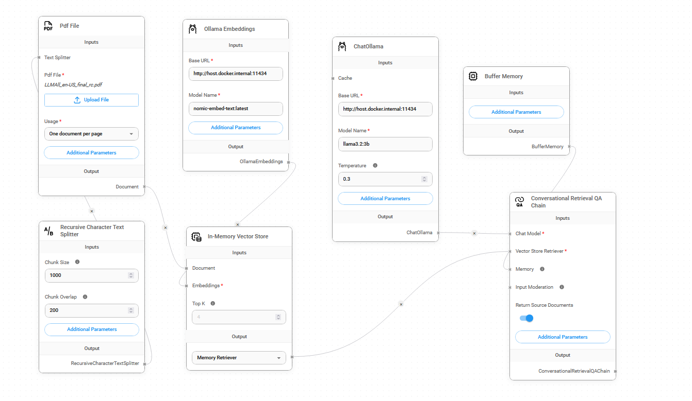

# Chat Privately with Your Documents: Local RAG with Flowise

Hi there! 👋 Welcome to **flowise-private-doc-chat-rag-blog**, where we explore how to build a fully private, conversational interface for your documents. Using **Flowise**, open-source LLMs, and **retrieval-augmented generation (RAG)**, you can chat with your documents locally—no internet connection required.

This setup is perfect for those who value **data privacy** but still want the benefits of interacting with their documents using cutting-edge AI.

---

## 🛠️ Key Features

- **Privacy First:** All processing happens locally—your documents and queries never leave your machine.
- **PDF Compatibility:** Upload and process your PDFs effortlessly.
- **Intelligent Splitting:** Dynamically splits your documents into chunks for better embeddings and retrieval.
- **Powerful Embeddings:** Generate embeddings using the Ollama `nomic-embed-text` model.
- **Conversational Memory:** Maintain chat history for contextually aware responses.
- **Locally Hosted LLMs:** Use open-source models like Llama 2 via the Ollama server.

---

## 🚀 How It Works

Here's a quick breakdown of the workflow:

1. **📄 PDF Loader:** The system uploads and parses your PDF into manageable text chunks.
2. **✂️ Text Splitter:** Chunks are split into smaller, overlapping sections to preserve context.
3. **📊 Embedding Creation:** Text is transformed into vector embeddings using the Ollama model.
4. **💾 Vector Store:** Embeddings are stored in memory for quick retrieval.
5. **💬 Conversational Chain:** A retrieval-based Q&A system connects with a local LLM for seamless, context-aware conversations.

Here's what the Flowise workflow looks like:


---

## 🖥️ Setup Instructions

### Prerequisites
- **Docker:** For running the Ollama server.
- **Node.js:** To install and run Flowise.
- **A PDF Document:** Your chat-ready file.

### 1. Clone This Repository
```bash
git clone https://github.com/yourusername/flowise-private-doc-chat-rag-blog.git
cd flowise-private-doc-chat-rag-blog
```

### 2. Start the Ollama Server
Make sure Docker is installed, then pull and run the Ollama container:
```bash
docker pull jmorganca/ollama
docker run -d -p 11434:11434 jmorganca/ollama
```

### 3. Install and Start Flowise
Set up Flowise to manage your chatflow:
```bash
npx flowise
```

Visit `http://localhost:3000` to open the Flowise dashboard.

### 4. Import the Chatflow
1. Navigate to **Chatflows** in Flowise.
2. Import the file `Chatbot1 Chatflow.json` from this repository.
3. Connect your nodes and adjust parameters (like chunk size) as needed.

### 5. Test It Out
- Upload your PDF file.
- Start chatting with your document!

---

## ⚙️ Customization

Feel free to tweak these settings:

- **Embedding Model:** Update the embedding model in the **Ollama Embeddings** node to try different configurations.
- **Chunking:** Adjust `Chunk Size` and `Chunk Overlap` in the **Recursive Character Text Splitter** node for better control over how your document is processed.
- **LLM Model:** Switch the LLM in **ChatOllama** to explore different local models.

---

## 📚 Why This Project?

I’ve always wanted a way to interact with sensitive documents securely, without relying on third-party services. With Flowise and Ollama, I can process and chat with documents in a **completely private** environment. Whether you’re analyzing research papers, contracts, or notes, this setup is easy to use and incredibly powerful. Plus, it’s fun!

---

## 🙋 FAQ

### 1. Why use Ollama and Flowise?
Ollama lets you host open-source LLMs locally, and Flowise makes it super easy to create workflows for document processing. Together, they’re a perfect match for private RAG systems.

### 2. What models are supported?
This project uses **Llama 2** via Ollama, but you can switch to other compatible models.

### 3. Can I use this on Windows/Mac/Linux?
Yes! As long as you have Docker and Node.js installed, this works on any major operating system.

---

## 🛠️ Contributions

This is a personal project, but I’d love for others to contribute! If you’ve got ideas for improving the workflow or want to add features, feel free to submit a pull request.

---

## 📜 License

This project is licensed under the MIT License. See the [LICENSE](./LICENSE) file for details.

---

### Acknowledgments

- [Flowise](https://github.com/FlowiseAI/Flowise) for their amazing open-source tool.
- [Ollama](https://ollama.ai) for enabling local LLM hosting.
- My fellow open-source enthusiasts for inspiring this project!

Let’s build something awesome! 🚀
